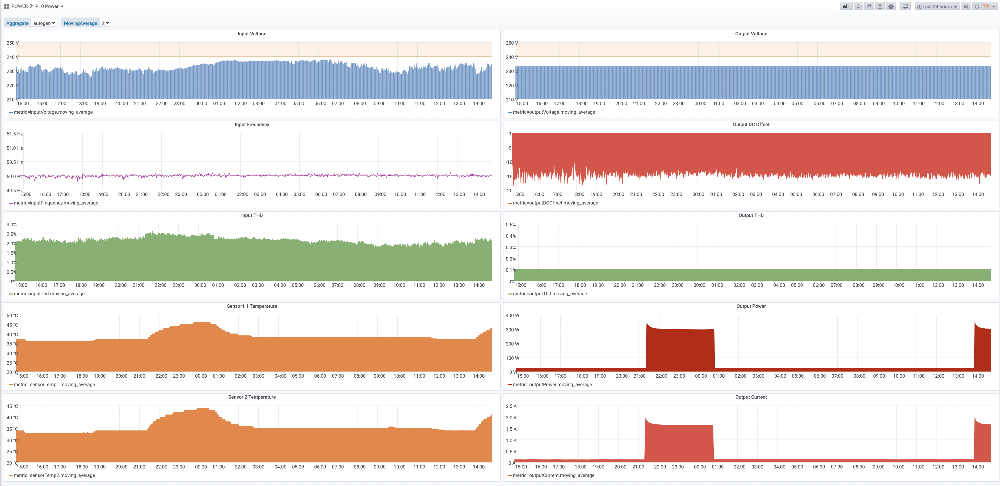

This endless-loop script is collecting available data from LAN-connected PS Audio Powerplant unit. Tested with P10 Unit.
Collected data are being sent to InfluxDB to be available for Grafana for example.

Sample screenshot:

